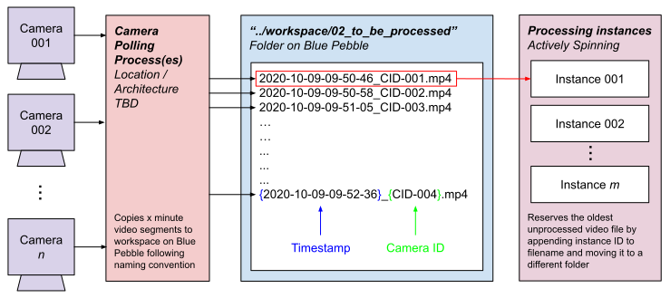
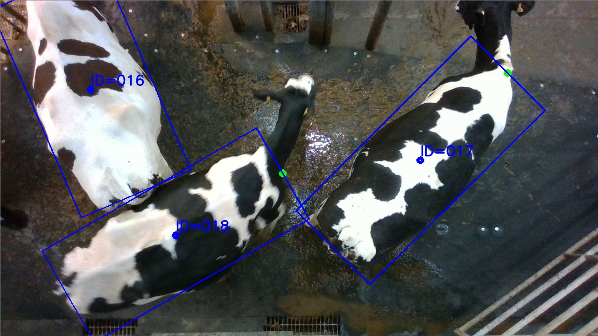

# ATI-Pilot-Project

This repository contains all source code for the Alan Turing Institute Pilot Project performing persistent cattle tracking and monitoring on the Wyndhurst farm.
The core processing component of this software is intended to be run on the Blue Pebble nodes dedicated to this project.
This component processes short video segments from the cameras and stores identity and tracking data to a database for researchers to use.
This software can also be used to re-train detection and identification models, and much more.

This readme file gives installation instructions and provides insight into how this software should be interacted with and how processing is performed.

## Blue Pebble

Blue Pebble is one of the university's high performance computing cluster, much like Blue Crystal.
This project makes use of GPU nodes dedicated to this project to process incoming videos.
To use the cluster, you need to have an account created for you by the ACRC team, contact Simon Burbidge ([simon.burbidge@bristol.ac.uk](simon.burbidge@bristol.ac.uk)).
A draft of the user guide is included in this repository under `.../ATI-Pilot-Project/other/Blue-Pebble-intro-draft.docx`, some of the main points are covered below.

### Connecting

To connect to Blue Pebble in any form, you need to first be connected to the university's VPN or be using a computer on campus ([instructions on using the VPN](https://uob.sharepoint.com/sites/itservices/SitePages/vpn.aspx)).
- **SFTP**: To transfer files inbetween a local machine and Blue Pebble, it's recommended to use a free graphical application like [FileZilla](https://filezilla-project.org/). Connect to Blue Pebble with the host name `sftp://bp1-login01b.acrc.bris.ac.uk` plus your username and password.
- **SSH**: To connect via the command line, in a shell type: `ssh {your-username}@bp1-login01b.acrc.bris.ac.uk`, you'll then get prompted for your password. You'll then be connected to one of the login nodes that don't have any GPUs nor any real compute capabilties. The main way of submitting work for processing is using the job scheduling system (details can be found in the document provided above). To directly interact with with a GPU node (principally for testing and prototyping), run the script `.../ATI-Pilot-Project/jobs/go_interactive_BP.sh`.

### Usage
- **qstat**: display jobs you have currently running
- **qsub**: submit a job, an example would be `qsub {your-script}.sh`
- **qdel**: delete a job, an example would be `qdel 123456.bp1`. Determine the job number by using `qstat`.

## Installation

Simply clone this repository to the desired directory with the command `git clone https://github.com/CWOA/ATI-Pilot-Project.git`.

### Depedencies

This code has been written for Python 3.6+ and depends on many external libraries.
The easiest way to install all of the depedencies is to replicate the development environment using anaconda.
On Blue Pebble, type `module avail` to view the list of modules and libraries available on the cluster (this list is common between the login node and GPU/compute nodes).
We want to use anaconda, python 3.6+ and tensorflow, so then run the command `module load lang/python/anaconda/3.7-2020.02-tensorflow-2.1.0` which you should have seen when running `module avail`.
One step that you'll need to do is open `.../ATI-Pilot-Project/conda_environment.yml` and modify part of the `prefix: ` path attribute at the very end of the file to your own username on Blue Pebble.
Change directory to where you cloned this repository `cd .../ATI-Pilot-Project` on Blue Pebble and run the command `conda env create -f conda_environment.yml`, which will take a little while to download and install all the dependencies.
Once complete, activate the environment with `source activate cows`.
If you haven't used anaconda before, you may have to run the command `conda init bash` and relaunching the shell (on Blue Pebble, closing a SSH connection and re-logging in) before you're able to activate the environment.
Verify the new environment was installed correctly with `conda env list` and compare this against the list of dependencies in the `conda_environment.yml` file.
Each time you log onto Blue Pebble, you need to reload the correct module and activate the anaconda environment which can be achieved in a single command with: `module load lang/python/anaconda/3.7-2020.02-tensorflow-2.1.0 && source activate cows`.

Alternatively, you could install the dependencies by looking through `conda_environment.yml` and using `pip` to install each one manually (not recommended).

### File Paths

Files that are too large to be included in this repository can be found on the `lab.biospi.org` server, see the section below titled `External Files (Model Weights, Datasets)` for details on accessing these files.
You'll need to place these in some location local to Blue Pebble so they can be loaded during processing and training.
Next you'll need to tell this software where it can find those files.
*All* filepaths should be specified in `.../ATI-Pilot-Project/src/config.py`, where you can specify your username (line 33) on Blue Pebble and then follow the file placement conventions set out in that file.
Alternatively, overwrite those filepaths with your own locations as desired.
For completeness, here are the folders and filepaths that need to be created on Blue Pebble for `.../ATI-Pilot-Project/src/config.py` to function fully without needing to edit the file (apart from setting your username on line 33. In all of the examples, you would replace `ca0513` with your own username on Blue Pebble.
- **Line 39**: Place this repository itself in your home directory. Example: `/home/ca0513/ATI-Pilot-Project`.
- **Line 70**: In your work directory, create the workspace folder. For me this would be `/work/ca0513/ATI-workspace` and then create the folders `/work/ca0513/ATI-workspace/database` and then finally `/work/ca0513/ATI-workspace/database/csv`.
- **Line 85**: In the workspace folder, create the videos folder: `/work/ca0513/ATI-workspace/videos`. Then we need to create 4 folders within that folder that are named in accordance with lines 88, 91, 94 and 97 that for me would be: `/work/ca0513/ATI-workspace/videos/01_copying_in_progress`, `/work/ca0513/ATI-workspace/videos/02_to_be_processed`, `/work/ca0513/ATI-workspace/videos/03_processing_in_progress` and `/work/ca0513/ATI-workspace/videos/04_processed`.
- **Line 128**: We need to point to where to find model weights for the detection network. Retrieve the detection weights from the lab.biospi.org server at the location: `/mnt/storage/scratch/data/Wyndhurst/video_2020-03-19/model-weights/rotated-detection/jing-70-percent-of-data_OPTIMISER_WEIGHTS_REMOVED.h5` and place them in your work directory on Blue Pebble at the location: `/work/ca0513/models/RGBDCows2020/weights/retinanet/`. You'll need to create those series of folders.
- **Line 168**: Finally and similarly to the point above, we need to point to where to find model weights and pre-inferred embeddings for the identification network. Retrieve the files again from the lab.biospi.org server at the location: `/mnt/storage/scratch/data/Wyndhurst/video_2020-03-19/model-weights/identification`. In that folder you should find three files: `best_model_state.pkl`, `test_embeddings.npz` and `train_embeddings.npz`. Copy them all to your work directory on Blue Pebble at the location: `/work/ca0513/models/RGBDCows2020/weights/latent-space/fold_0`. Again, you'll need to manually create those series of folders.

## Processing Operation

Multiple instances of the processing program can be spawned at any one time for improving concurrent operation, simply provide a unique identifier to each instance via a command line argument.
These processes simultaneously monitor and process video files in a folder that is written to by the cameras and their supporting software.

### Video File Management

The supporting camera software should copy video segments to a working directory local to the processing software (e.g. on Blue Pebble).
- When files are in the process of being copied across (from Wyndhurst to Clifton/Blue Pebble) they should be temporarily placed in a folder: `.../workspace/01_copying_in_progress`.
- When copying of an individual video file is complete, that file should be automatically moved to: `.../workspace/02_to_be_processed`. The processing instances monitor this folder and take a video file to process when they're free to do so.
- To signal that an instance is processing a particular video file, it will temporarily move that video to: `.../workspace/03_processing_in_progress` and add it's unique identifier to the end of the filename to store which instance processed it (e.g. `PID-001`). This also serves to lock the file so that multiple instances do not attempt to process the same file.
- Once the instance has finished processing the file and stored data extracted from it permanently, the file will finally be moved to: `.../workspace/04_processed` where it could be for example kept for some amount of time, etc.

### Naming Convention

Video files written and copied by the camera software must follow a strict naming convention for this software to operate properly.
Filenames should include the camera ID that created the video as well as the date/time at which filming first started.
An example filename following the convention would be:
`2020-02-05-13-27-01_CID-001.avi`
which is in the format:
`{year}-{month}-{day}-{hour}-{minute}-{second}_CID-{camera unique identifier}.avi`.
In this way, the folder can be sorted by timestamp so that the oldest video file will be processed first.
This means that in the build up of a backlog of videos to be processed, there isn't a file that will never get processed.

Once an instance has locked the file for processing, and when the instance has finished processing it, the filename would automatically become:
`2020-02-05-13-27-01_CID-001_PID-001.avi`
to include the unique identifier for the instance that processed it.
For the full implementation, refer to the file `.../ATI-Pilot-Project/src/Utilities/FileSystemManager.py`

The following image illustrates the file management and naming convention:

### Video Processing

During processing of a single video file, there are several steps that occur:
1. **Frame Extraction**: the video will be played through sequentially and individual frames/images will be extracted at some controllable framerate (e.g. one frame per second). Once a sufficient number of unprocessed frames have been built up to fill an image batch, processing moves to the next step
2. **Rotated Cattle Detection**: for a batch of images, an extension of RetinaNet is used to detect the location, size and orientation of whole cattle present in each image in the batch. The result is a list of subimages that enclose each cow's torso called a region of interest (RoI).
3. **RoI Identification**: Each RoI detected and extracted by the previous stage are then identified and have a single number unique to each individual in the farm associated with them. Once each RoI has been identified, we're ready to store data about this observation.
4. **Permanent Storage**: Each observation of an animal (an identified RoI) is then stored permanently for researchers to access and utilise. For some observation, we store: the unique identifier for the camera that created the video file, the unique identifier for the instance that processed the video, the unique identifier for the cow that was identified in this observation, the centrepoint (cx, cy) of the detected cow in the image (in pixels), the width and height of the box that encloses the cow's torso in pixels, the orientation of the cow in radians (aligned with the front of the animal), the confidence that the detection stage had in its detection, the date and time at which this observation occurred, the ID of the frame into the video and finally the filename for the video itself.
5. Repeat: following processing of this batch of frames, this process (1-4) repeats until the entire video has been processed.

The following image illustrates the processing pipeline for a single video file:

### Usage

To run the processing software interactively, change directory to the source folder of this repository `cd .../ATI-Pilot-Project/src`. The core software is run from the Coordinator:
- **Coordinator**: Run the processing software via `python Coordinator.py --process_ID={unique process ID}`. This runs a single instance of the processing software that behaves in the way described in the previous section. Run multiple of these to improve concurrent performance, giving a unique process ID to each instance that is spawned. To get help with setting additional command line arguments, run the command `python Coordinator.py -h`.
- **Configuration**: all constant parameters are stored in `.../ATI-Pilot-Project/src/config.py`. Parameters are grouped into which file they correspond to and control things like the batch size, number of frames to skip when extracting, etc.

The other way of running the processing software when on Blue Pebble is by submitting a script to the job scheduling system.
Examples of those scripts are given in `.../ATI-Pilot-Project/jobs/coordinator/launch_coordinator-PID_001.sh`, which specifies a job to run a processing instance with process ID as 1, have a look at that script for an example of a PBS script.
To submit the job to the scheduler, assuming you are in the same directory as the script, you would simply type `qsub launch_coordinator-PID_001.sh`.

### Validation (via Visualisation)

To manually validate whether the system is working as expected, you can visualise the output of the extracted data. 
All you need to do is run the processing software on a selection of videos so that there is data present in the output CSV file and that the videos are now in the `.../workspace/04_processed` folder.
Change directory to `.../ATI-Pilot-Project/src/Visualiser` and then run `python VisualisationManager.py`.
The program will sequentially go through each individual video file specified in the CSV file and if it finds a corresponding video file in the processed folder it will visualise it.
For a single video, the program will sequentially progress through the video, displaying rotated detections with inferred cattle identities for each extracted and processed frame.
When you run the program, it will display a single frame, progress to the next by pressing enter.
Note that since this is graphical software, it will need to be run on a machine locally and not through SSH.

The following image shows an example of what the visualisation output looks like (the green circle indicates the inferred direction of the cow): 

#### External Files (Model Weights, Datasets)

The processing software - specifically (a) Rotated Cattle Detection and (b) RoI Identification - relies upon previously trained Convolutional Neural Networks.
To restore their fully trained state, the weights of the network were saved to file and are loaded each time a processing instance is instantiated.
Weight files are generally too large for use for git and so are stored elsewhere.
This is equally the case for training and testing datasets.
Files like tese have been stored on the `lab.biospi.org` server, to gain access to this server, contact Ranjeet Bhamber ([ranjeet.bhamber@bristol.ac.uk](mailto:ranjeet.bhamber@bristol.ac.uk)) and ask him to give you read access to the following directories:
- **Model Weights**: all model weight and auxiliary files can be found at: `/mnt/storage/scratch/data/Wyndhurst/video_2020-03-19/model-weights`
	- **Rotated Detection**: the detector weights file are in the folder `rotated-detection` and should be placed in the desired location specified in `.../ATI-Pilot-Project/src/config.py` or modify the paths in that file accordingly.
	- **RoI Identification** the identification network weights and pre-inferred embeddings are in the folder `identification` and similarly should be placed according to the configuration file or update the paths within the file.
- **Datasets**: `/mnt/storage/scratch/data/Wyndhurst/video_2020-03-19/final-datasets`.
- **Example Video Files**: Some example video files that can be used to test this processing software can be found in the directory: `/mnt/storage/scratch/data/Wyndhurst/video_2020-03-19/example-videos`.

These can then be copied to some location on Blue Pebble as needed, just be sure to correctly set the paths and your username in `.../ATI-Pilot-Project/src/config.py`. See the section above on **File Paths** for more detailed full instructions on how to do this.

## Extracted Data

Extracted data is stored permanently in one of two ways, either to a simple CSV file format (mostly just for ease of debugging) or to a mysql database (not yet tested nor fully implemented).
This is managed by the file: `.../ATI-Pilot-Project/src/Database/DatabaseManager.py`.
To configure where to write extracted data to, look in `.../ATI-Pilot-Project/src/config.py`.

## Logging

Logs are stored in `.../ATI-Pilot-Project/logs/` and sorted by process ID.
Logs store normal and debugging information, warnings, errors and critical errors and are primarily useful in order to monitor execution, find abnormalities/problems, etc.
You can select whether logs are written to file or just to the console via setting the boolean on line 42 of `.../ATI-Pilot-Project/src/config.py`.

## Model Re-training

To obtain new model weights by re-training, you'll need to re-train one of the systems (Detction or Identification) with new data, different hyperparameters, etc.:
- **Rotated Cattle Detection**: contact Jing Gao ([jing.gao@bristol.ac.uk](mailto:jing.gao@bristol.ac.uk)).
- **RoI Identification**: You need to run `.../ATI-Pilot-Project/src/Identifier/MetricLearning/train.py`. To modify its performance as necessary, it takes command line arguments - if you were in the same directory as the class, type `python train.py -h` for help with setting these arguments. Note that you'll need to have access to a GPU (on a local machine or in an interactive session on Blue Pebble). Example shell scripts that set some of these arguments can be found in `.../ATI-Pilot-Project/src/Identifier/MetricLearning/scripts/`. One important aspect is that data is packaged in the way that PyTorch expects it by inheriting the `Dataset` class from PyTorch. Have a look at `.../ATI-Pilot-Project/src/Datasets/OpenSetCows2019.py` and `.../ATI-Pilot-Project/src/Datasets/RGBDCows2020.py` for examples on how to do this correctly. To run training on an existing dataset (e.g. RGBDCows2020), look at the section above on External Files and place the dataset at some location in your work directory on Blue Pebble. Then edit line 197 in `.../ATI-Pilot-Project/src/config.py` to point at where the code can find the dataset.

## Troubleshooting

- All written code is fairly well documented/commented, so have a look in each file for pointers about how the code operates, inputs/outputs, etc.
